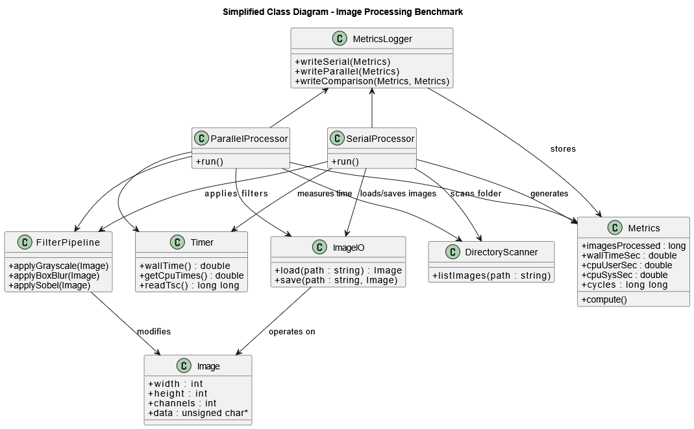
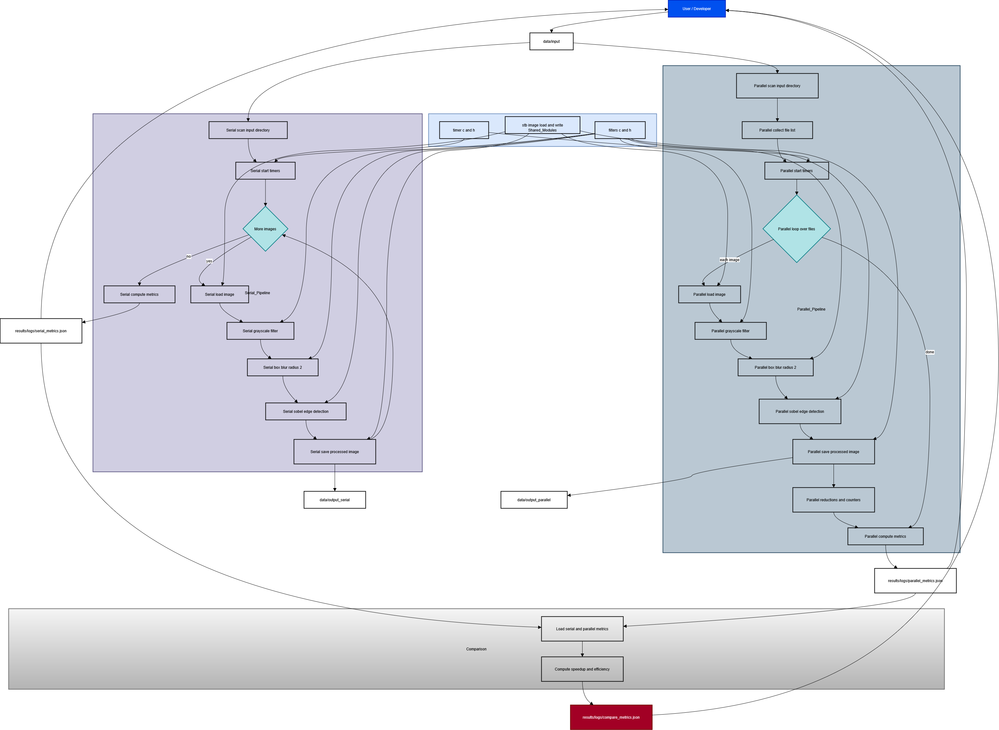
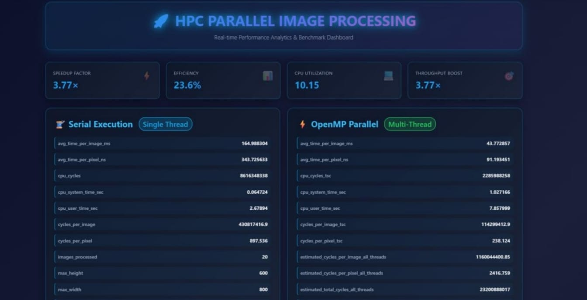
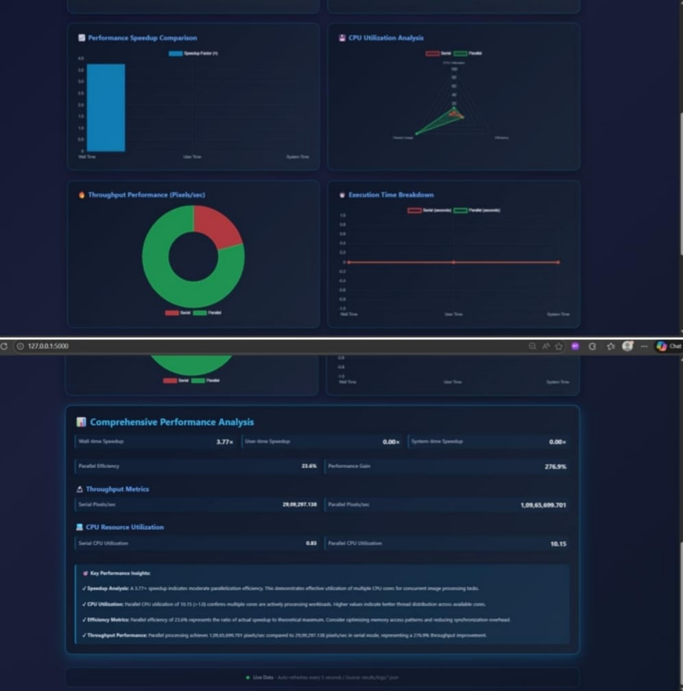

# HPC-Accelerated Image Processing: OpenMP Multi-Threading Performance Benchmark (Serial vs Parallel)

This repository presents a **comprehensive High-Performance Computing (HPC) benchmarking framework** that evaluates the impact of **shared-memory parallelism using OpenMP** on a realistic, non-trivial **image processing workload implemented in C**. The project is designed to go beyond a minimal demo by combining **low-level systems programming**, **fine-grained performance instrumentation**, and a **web-based visualization layer** for intuitive analysis.

At its core, the system processes a directory of images through a fixed pipeline of classical image-processing filters. Two functionally equivalent implementations are provided: a **serial single-threaded baseline** and a **parallel multi-threaded OpenMP version**. Both variants collect detailed performance metrics—including wall-clock time, CPU time, and cycle counts—which are exported as structured JSON logs. These logs are then consumed by a **Flask-based web dashboard** that enables interactive, real-time comparison of serial and parallel execution behavior.

---



## Key Highlights

* Native **C implementation** with minimal abstraction overhead
* Identical serial and OpenMP-parallel pipelines for fair benchmarking
* High-resolution timing and cycle-level measurements
* Perf-like estimation of **total CPU cycles across all threads**
* Structured JSON logging for reproducibility and post-processing
* Full-stack integration with a **Flask + Chart.js analytics dashboard**
* Clear separation between compute, measurement, and visualization layers

---

## 1. Project Goals

The primary goals of this project are:

* Implement a simple but non-trivial **image processing workload** suitable for performance studies
* Provide two implementations of the same pipeline:

  * **`serial`** – single-threaded baseline
  * **`parallel`** – multi-threaded implementation using OpenMP
* Measure and compare:

  * Wall-clock execution time
  * CPU user and system time
  * Raw Time Stamp Counter (TSC) cycles
  * **Estimated total cycles across all threads** (perf-style metric)
  * Throughput (pixels/second, images/second)
  * Speedup and parallel efficiency
* Enable easier interpretation of results through **web-based visualization**

The project is suitable for **HPC coursework, operating systems labs, parallel programming assignments, and performance engineering demonstrations**.

---

## 2. Directory Layout

```text
bin/        # Compiled binaries (serial, parallel)
data/
  input/               # Input images (PNG/JPG/BMP/…)
  output_serial/       # Outputs produced by serial run
  output_parallel/     # Outputs produced by parallel run
results/
  logs/
    serial_metrics.json    # Metrics from serial run
    parallel_metrics.json  # Metrics from parallel run
    compare_metrics.json   # Serial vs parallel comparison
src/
  filters.c, filters.h
  serial.c
  parallel.c
  timer.c, timer.h
  stb_image.h
  stb_image_write.h

# Web application
app.py
templates/
  index.html
```

The directory structure enforces a **clear separation of concerns**:

* `src/` contains all performance-critical C/OpenMP code
* `results/` stores experiment outputs and acts as a persistent benchmark log
* The web application layer is **read-only** and never modifies benchmark results

By default, both `serial` and `parallel` binaries read from `data/input` and write processed images to `data/output_serial` and `data/output_parallel` respectively. All required directories are created automatically if missing.

---



## 3. Image Processing Pipeline

All images are handled as **interleaved 8-bit RGB buffers** using a minimal `Image` structure:

```c
typedef struct {
    int width;
    int height;
    int channels;      // always 3 (RGB)
    unsigned char *data;
} Image;
```

This representation keeps memory layout simple and cache-friendly, which is essential for meaningful performance measurements.

### 3.1 Loading and Saving Images

* **Loading**: `load_image(const char *path)` (defined in `filters.c`) uses `stb_image.h` to decode images and **forces all inputs to 3-channel RGB**, regardless of the original format.
* **Saving**: `save_image_png(const char *path, const Image *img)` uses `stb_image_write.h` to store processed outputs as PNG files.
* **Cleanup**: `free_image(Image *img)` releases both the pixel buffer and associated metadata.

Supported input formats include PNG, JPEG, BMP, and other formats supported by `stb_image`. Non-image files are automatically ignored.

### 3.2 Filter Pipeline

Each image is processed using the same fixed pipeline in both serial and parallel implementations:

1. **Grayscale Conversion** (`apply_grayscale`)

   * Computes luminance using the standard formula:
     `0.299 * R + 0.587 * G + 0.114 * B`
   * The resulting grayscale value is written back to all three RGB channels.

2. **Box Blur** (`apply_box_blur`)

   * Implements a **separable blur** consisting of:

     * A horizontal pass into a temporary buffer
     * A vertical pass back into the original image
   * Uses a sliding window of size `(2 × radius + 1)` along each axis
   * The blur radius is fixed to `2` for all experiments
   * This stage is particularly useful for studying **memory bandwidth and cache effects**

3. **Sobel Edge Detection** (`apply_sobel_edge`)

   * Converts RGB data into a temporary grayscale buffer
   * Applies classic 3×3 Sobel kernels (`Gx`, `Gy`) to compute gradient magnitude
   * Magnitudes are clamped to `[0, 255]` and written back to all RGB channels

All filters operate **in-place**, avoiding repeated allocations and ensuring that performance measurements reflect computation and memory access rather than allocation overhead.

---

## 4. Serial Implementation (`serial.c`)

The serial program provides a **single-threaded baseline** against which all parallel results are compared. Its execution flow is as follows:

1. Opens the input directory (`data/input` by default)
2. Iterates through all directory entries, skipping non-image files
3. For each image:

   * Constructs full input and output paths
   * Loads the image using `load_image()`
   * Updates global counters such as:

     * `images_processed`
     * `total_pixels`
     * `max_width`, `max_height`
   * Applies the full filter pipeline:

     ```c
     apply_grayscale(img);
     apply_box_blur(img, 2);
     apply_sobel_edge(img);
     ```
   * Saves the processed image to the output directory
4. Measures performance for the **entire run**, including:

   * Wall-clock time
   * CPU user and system time
   * Raw TSC cycle count
5. Computes derived metrics such as:

   * Average time per image and per pixel
   * Cycles per image and per pixel
6. Writes all metrics to `results/logs/serial_metrics.json`

A concise summary is also printed to standard output for quick inspection.

---

## 5. Parallel Implementation (`parallel.c`)

The parallel implementation performs **exactly the same logical work** as the serial version, but distributes images across multiple threads using OpenMP.

### 5.1 Execution Overview

1. Collects all valid image filenames into a dynamically allocated list
2. Starts timing and cycle counters
3. Executes an OpenMP `#pragma omp parallel for` loop over the image list
4. Each iteration:

   * Loads a single image
   * Applies the identical filter pipeline
   * Saves the processed result
5. Uses OpenMP reduction clauses to safely aggregate:

   * Total pixels processed
   * Number of images processed
   * Maximum width and height
6. Stops timers and computes the same base metrics as the serial version
7. Derives **additional parallel-specific metrics**, including estimated total CPU cycles across all threads
8. Writes results to `parallel_metrics.json` and generates `compare_metrics.json` if serial data is available

### 5.2 Perf-like Cycle Estimation

Because the Time Stamp Counter reflects wall-clock cycles on a single core, it does not directly capture total CPU work in a multi-threaded run. To approximate a `perf stat`-style metric, the following estimate is used:

```text
estimated_total_cycles_all_threads
  ≈ cpu_cycles_TSC × (cpu_total_time_sec / wall_time_sec)
```

From this estimate, the code derives:

* Estimated cycles per image (all threads)
* Estimated cycles per pixel (all threads)

These values provide a more realistic picture of **overall CPU consumption** during parallel execution.

### 5.3 Comparison Metrics

If `serial_metrics.json` exists, the parallel program automatically generates `compare_metrics.json`, which includes:

* Wall-time speedup
* CPU-time speedups
* Throughput speedup (pixels/second)
* Parallel efficiency (`speedup / threads_used`)
* CPU utilization for serial and parallel runs
* Estimated total CPU cycles for both variants

---

## 6. Timing and Cycle Measurement (`timer.c`, `timer.h`)

The timing module provides a unified interface for all measurements:

* `wall_time()` – high-resolution wall-clock time via `clock_gettime(CLOCK_MONOTONIC)`
* `get_cpu_times()` – user and system CPU time via `getrusage(RUSAGE_SELF)`
* `read_tsc()` – raw cycle count using `RDTSC` on x86, with a portable fallback on other architectures

Both serial and parallel binaries rely on this shared implementation to ensure **consistent measurement methodology**.

---

## 7. JSON Metrics Format

All benchmark results are stored as structured JSON files for easy parsing and visualization.

### 7.1 Serial and Parallel Metrics

Both `serial_metrics.json` and `parallel_metrics.json` share a common schema, with additional fields for the parallel case (e.g., thread count and estimated total cycles).

These files record:

* Input/output configuration
* Raw timing and cycle counters
* Derived averages and throughput metrics
* Image and pixel statistics

### 7.2 Comparison Metrics

The `compare_metrics.json` file aggregates serial and parallel results into a single document, making it straightforward to generate plots or compare multiple runs across systems.

---

## 8. Web Application Architecture (Visualization Layer)

To simplify analysis and presentation of benchmark results, the project includes a **Flask-based web application** that visualizes the generated JSON metrics.

### 8.1 Flask Backend (`app.py`)

The backend server:

* Loads JSON metric files from `results/logs/`
* Exposes REST-style API endpoints (`/api/serial`, `/api/parallel`, `/api/compare`)
* Handles missing or incomplete data gracefully
* Renders the main dashboard page

No computation is performed at this layer; it remains fully decoupled from the C/OpenMP benchmarks.

### 8.2 Frontend Dashboard (`templates/index.html`)

The frontend provides a responsive, interactive dashboard built with HTML, CSS, JavaScript, and **Chart.js**. Key features include:

* Automatic refresh to reflect newly generated benchmark results
* Side-by-side comparison of serial and parallel performance
* Visualizations for speedup, throughput, execution time, and CPU utilization
* Clean separation between data fetching and presentation logic

The overall data flow is:

```text
C Benchmarks → JSON Logs → Flask API → Browser → Interactive Charts
```

---



## 9. Building the Project

### 9.1 Requirements

* POSIX-like environment (Linux, macOS, or WSL)
* C compiler with C11 (or C99) support
* OpenMP support (`-fopenmp`) for the parallel version
* Math library (`-lm`) for Sobel filtering
* Python 3.8+ and Flask (for the dashboard)

### 9.2 Example Build Commands

```bash
mkdir -p bin

# Serial
gcc -O3 -Wall -std=c11 \
    src/serial.c src/filters.c src/timer.c \
    -o bin/serial -lm

# Parallel
gcc -O3 -Wall -std=c11 -fopenmp \
    src/parallel.c src/filters.c src/timer.c \
    -o bin/parallel -lm
```

---

## 10. Running the Benchmarks

1. Place input images into `data/input/`
2. Run the serial version first:

   ```bash
   ./bin/serial
   ```
3. Run the parallel version:

   ```bash
   ./bin/parallel
   ```

Running the serial version first enables full comparison metrics to be generated during the parallel run.

---

## 11. Running the Web Dashboard

```bash
pip install flask
python app.py
```

Open a browser and navigate to:

```text
http://127.0.0.1:5000/
```

The dashboard can remain running while benchmarks are re-executed, allowing live updates of performance data.

---



## 12. Extending the Project

Potential extensions include:

* Adding new image filters or kernels
* Making the pipeline configurable via command-line arguments
* Experimenting with different OpenMP scheduling policies
* Capturing hardware metadata (CPU model, cores, cache sizes)
* Exporting results as reports (CSV/PDF)

---

## 13. Third-Party Libraries and Licensing

* **stb_image.h** and **stb_image_write.h** (MIT/Public Domain)
* **Flask** (BSD-style license)
* **Chart.js** (MIT license)

All dependencies use permissive licenses suitable for academic and experimental use.

---

## 14. Summary

This project delivers a **complete HPC benchmarking and visualization framework** that combines:

* Low-level C/OpenMP systems programming
* Accurate timing and cycle-level performance measurement
* Structured JSON-based experiment logging
* A modern web-based analytics dashboard

It serves as a strong reference implementation for studying **parallel performance, scalability, and efficiency on shared-memory systems**.
